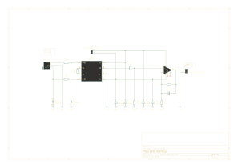
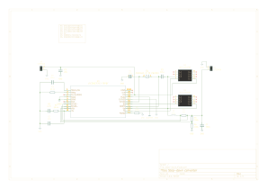

# EKG Hardware Project

⚠️ Note: This project is a work in progress. Features and documentation may change frequently.

## Overview
This repository contains the design and documentation files for an EKG hardware project in an Electronics Design course. The project includes schematics, PCB layouts, useful scripts, and other design resources created using **KiCad**.

## Features
- **Modular design**: Allows easy modifications and improvements.
- **Open-source**: All design files and documentation are freely available.

## Repository Contents
- `ekg-interface/`- Design files for the EKG interface.
- `step-down/` - Design files for the step-down converter.

## Schematics
### EKG Interface


### Step-Down Converter


## Tools Used
- **KiCad** - Open-source PCB design tool.
- **LTspice** - Circuit simulation.

## Getting Started
1. Clone this repository:
   ```sh
   git clone https://github.com/oveljosland/ekg-project.git
   ```
2. Open the schematics in **KiCad** or other EDA software.
3. Modify and generate PCB layout as needed.
4. Export Gerber files and fabricate the PCB.
5. Assemble and test!

## License
This project is licensed under the **MIT License**. See [LICENSE](LICENSE) for details.

## Contact
For questions or feedback, feel free to reach out via [GitHub Issues](https://github.com/oveljosland/ekg-project/issues).
